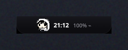
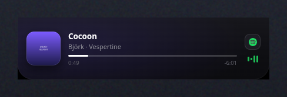
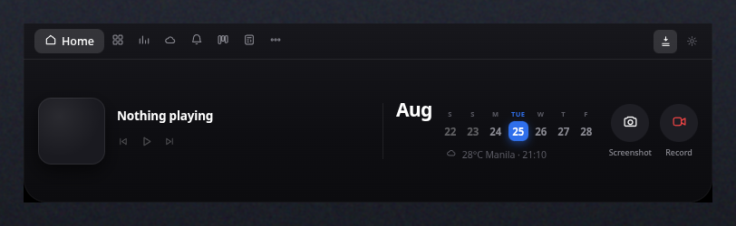
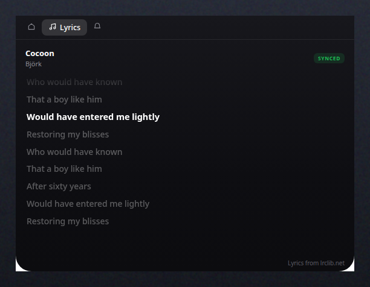
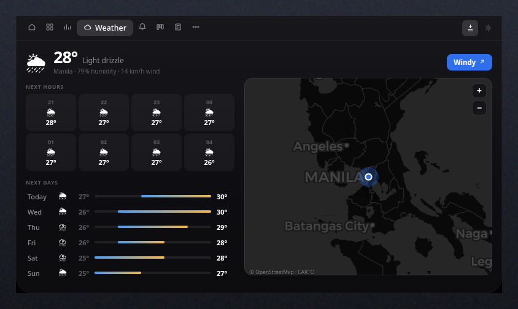
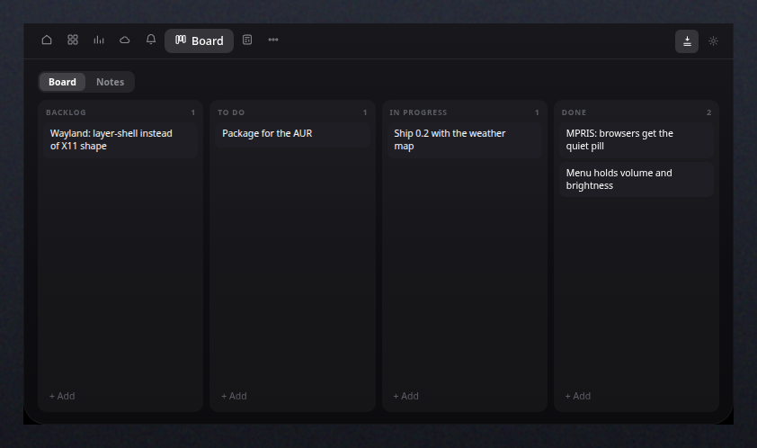
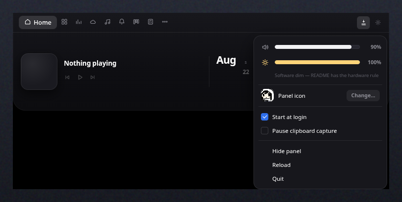

<div align="center">

# Island

**A Dynamic Island for Linux.** A panel that hangs from the top edge of the
screen, collapsed to a pill until you reach for it.

[](LICENSE)




</div>

---

Most desktop widgets ask for a slice of your screen and keep it. Island takes
none. It sits as a small pill at the top edge, and opens into a full panel only
when the pointer arrives. Every pixel that isn't the panel belongs to whatever
is underneath — clicks pass straight through.

Leave it alone and it goes to **stealth**: it drops almost all its height and
gains length, becoming a 272×15 strip along the top edge that reads as part of
the bezel rather than an object on the desktop. A hover brings it straight
back. `dormantDelayMs` sets how long that takes; the default is 90 seconds.

<div align="center">

</div>

Start playing something and it announces the track once, tinted by the cover's
own colour, then gets out of the way. Scroll a feed of videos and it stays a
quiet pill instead — a browser making noise is not a new song.

## Panels

<div align="center">

</div>

| | |
|---|---|
| **Home** | Now playing with transport and the source app's icon, a week calendar, weather, screenshot and screen recording |
| **Tray** | App launcher built from your `.desktop` entries, with pinning and search |
| **Stats** | CPU, memory, GPU and battery with real numbers, plus network throughput |
| **Lyrics** | Time-synced lyrics for whatever Spotify is playing, matched on duration |
| **Weather** | Hourly and daily forecast on a shared scale, over a dark map of where you are |
| **Alerts** | Live desktop notifications with an unread badge |
| **Board** | Kanban with drag-and-drop, plus notes |
| **Tools** | Calculator, document converter, budget tracker |
| **More** | Countdown timers and clipboard history |

<div align="center">

<br><em>Synced lyrics from LRCLIB, highlighted against the player's own clock</em>
<br><br>

<br><em>Forecast from Open-Meteo; map tiles fetched and composited in the main process</em>
<br><br>

</div>

## Install

Requires **KDE Plasma on X11**, Node 18+, and the `electron` package.

```bash
git clone https://github.com/marina21-cs/island.git
cd island
npm install
./scripts/island install
```

That copies the app to `~/.local/lib/island`, installs a systemd user service,
and starts it at every graphical login. The checkout is then free — move it,
delete it, keep hacking on it; the running panel does not care.

```bash
island status      # what is running, from where, and what starts it
island restart
island logs -f
island update      # redeploy from the checkout
island uninstall   # leaves your data in ~/.config/island
```

## Keys

| Shortcut | Action |
|---|---|
| `Ctrl+Alt+Space` | Toggle the panel |
| `Ctrl+Alt+V` | Clipboard history |
| `Ctrl+Alt+Shift+T` | Timers |
| `Ctrl+Alt+S` | Screenshot a region |
| `Ctrl+Alt+Shift+Q` | Quit |
| `Alt+1`–`Alt+8` | Jump between panels |
| `Esc` | Close the menu, then unpin |

`Ctrl+Alt+T` is deliberately unused — Plasma binds it to Konsole. A binding
Plasma already owns fails to register and says so on stdout instead of failing
silently.

## Two things that cost a day to find

Both of these are the reason this project exists in the shape it does, and
neither is obvious from the documentation.

### `setIgnoreMouseEvents` cannot work on X11

The natural way to build a click-through overlay is a full-screen transparent
window that ignores the pointer except where the UI is:

```js
win.setIgnoreMouseEvents(true, { forward: true })   // ← macOS and Windows only
```

`forward` is not implemented on Linux. Without it a click-through window
receives **no mouse events at all**, so the renderer can never notice the
pointer arriving. Polling from the main process does not rescue it either:

```js
setInterval(() => screen.getCursorScreenPoint(), 50)   // ← freezes
```

That value only refreshes when the app itself receives input, so the moment the
window goes click-through it sticks at the last known position. Measured over
five real pointer moves it reported the same coordinates every time.

**The X11 shape extension has neither problem.** The server clips input *and*
rendering to a region, so hover arrives as an ordinary DOM `mouseenter` and
everything outside reaches the desktop:

```js
win.setShape([{ x, y, width, height }])
```

The renderer reports the live rectangle of every floating surface on a rAF pump
while transitions run, and the main process turns that into the shape. One
consequence worth knowing: the shape clips rendering too, so an outer drop
shadow gets sliced at a hard edge. The panel ships without one — the real
Dynamic Island has no shadow either.

### Plasma on X11 runs a second D-Bus session

`startplasma-x11` spawns its own `dbus-daemon` rather than using the systemd
user bus. So your desktop applications sit on one bus:

```
DBUS_SESSION_BUS_ADDRESS=unix:path=/tmp/dbus-XXXXXXXX
```

…while anything systemd starts for you gets another:

```
DBUS_SESSION_BUS_ADDRESS=unix:path=/run/user/1000/bus
```

They are different buses. A panel started by systemd listens on one that no
media player or notification ever appears on — MPRIS and notifications are both
silently dead, while launching the same binary from a shell works perfectly.

`island autostart` writes the session's real bus address to `session.env`,
which the unit reads. Per-unit, not a global `set-environment`, which would
hand the session bus to every other user service too.

## Lyrics, and why they are Spotify-only

Lyrics come from [LRCLIB](https://lrclib.net) — free, no API key — and are shown
only for Spotify. Everything else that publishes to MPRIS, browsers especially,
reports metadata too loose to identify a *recording*: a tab title is not a track
name, and without a reliable duration there is nothing to match against.

Wrong lyrics that scroll in time are worse than no lyrics, because they look
authoritative. So the matching is deliberately strict:

1. **Exact first.** Artist, track, album and duration together. A wrong length
   returns 404 rather than someone else's words.
2. **Then a filtered search**, which only accepts a candidate whose normalised
   title matches, whose artist matches, and whose duration is within **3
   seconds**. Editions, `(Remastered)`, `- Live at …` and `feat.` are
   normalised away before comparing.
3. **Otherwise, nothing.** The panel says it found nothing instead of guessing.

A real match looks like this — Spotify reporting `Arriba! - Live` at 194.6s,
LRCLIB answering with `Arriba! (Live)` from the same album at 195.0s:

```
    title : Arriba! - Live        →   track : Arriba! (Live)
    artist: planetboom            →   artist: planetboom
    album : Sound Of Victory      →   album : Sound Of Victory
    length: 194.6s                →   length: 195.0s
```

MPRIS reports position about once a second, which is very visible on a lyric
line, so the renderer interpolates with the wall clock between reports and
resets on every real position update.

Widening this past Spotify is a one-line change to `SOURCES` in
`src/main/services/lyrics.js` — the accuracy guarantees above are what would
suffer, which is why it is not the default.

## Configuration

`~/.config/island/config.json`, merged over the defaults in
`src/main/config.js`:

```json
{
  "weatherCity": "Manila",
  "weatherLat": null,
  "weatherLon": null,
  "hoverDelayMs": 220,
  "collapseDelayMs": 700,
  "dormantDelayMs": 90000,
  "shadowPadding": 0,
  "hotkeys": { "toggle": "Control+Alt+Space" }
}
```

State lives beside it: `board.json`, `notes.json`, `budget.json`,
`timers.json`, `clipboard.json`, `pinned.json`.

## The gear menu

<div align="center">

</div>

The ⚙ in the nav opens an in-panel menu holding the volume and brightness
sliders, the panel icon, the login and clipboard toggles, and
hide/reload/quit. Right-clicking the panel opens it too. It replaced
Electron's native context menu, which cannot host a slider.

### Changing the panel icon

**Panel icon → Change…** takes any image — PNG, JPEG, WebP, GIF, SVG — and
normalises it to a 96px square stored in `~/.config/island/icon.png`. The
original can be moved or deleted afterwards; nothing points back at it.
**Reset** returns to the built-in icon, and only appears once you have set one.

Small sources are treated as pixel art: anything 128px or under is scaled with
nearest-neighbour and rendered with crisp edges, because smooth resampling
turns a sprite to mush at 26px. Larger images are resampled normally and
rendered smooth, because pixel-art rendering does the same damage to a
photograph in the other direction. Which of the two applies is decided once, at
import, and stored beside the image rather than guessed again at paint time.

## Brightness

The slider works out of the box, but in software: `xrandr --brightness`, which
is a gamma curve. It dims what you see; it does not dim the backlight, so it
saves no power and cannot exceed 100%.

Hardware control needs write access to `/sys/class/backlight/*/brightness`,
which is root-only by default. Grant it once and the panel switches over on its
own — it prefers hardware whenever the file is writable:

```bash
echo 'ACTION=="add", SUBSYSTEM=="backlight", RUN+="/bin/chgrp video /sys/class/backlight/%k/brightness", RUN+="/bin/chmod g+w /sys/class/backlight/%k/brightness"' \
  | sudo tee /etc/udev/rules.d/90-backlight.rules
sudo usermod -aG video "$USER"
```

Log out and back in for the group to take effect.

## Architecture

No bundler, no transpile, no build step. The source *is* what runs.

```
src/main/          window, X11 shape, hotkeys, tray, autostart
src/main/services/ mpris · vitals · audio · brightness · apps · notifications
                   capture · weather · map · timers · clipboard · convert · store
src/preload/       the contextBridge surface
src/renderer/      core.js (shape, modes, tab registry) · boot.js · tabs/
```

Adding a panel is one file in `src/renderer/tabs/` plus a `<script>` line:

```js
Island.registerTab({
  id: 'example',
  label: 'Example',
  icon: svg('<path d="…"/>'),
  width: 560,
  height: 320,
  mount(pane) { /* build your DOM */ },
  update(kind, data) { /* called on every service feed */ },
})
```

The nav sizes itself to whatever is registered, so a new panel cannot silently
clip the tab row.

## Privacy

Everything stays on your machine. There is no telemetry and no account. Three
things reach the network, all of them optional and all of them fetched by the
main process so the renderer's strict `Content-Security-Policy` never has to
allow remote content:

- **Open-Meteo** for the forecast — no API key, no identifier, just coordinates
- **CARTO** basemap tiles for the map, cached locally for a day
- **Cover art** for whatever is playing, when the player supplies an `https` URL
- **LRCLIB** for lyrics, queried by artist, title and duration — only while Spotify plays

## Known limits

- **Wayland is not supported.** The whole click-through approach is the X11
  shape extension. A Wayland port wants `wlr-layer-shell`, which is a different
  design, not a flag.
- **No FPS counter.** FPS is per-application; it needs a hook like MangoHud, not
  a system readout. The Stats panel shows CPU instead.
- **Windy's forecast API needs an account key**, so the Windy button opens
  windy.com at your coordinates rather than pretending to have data it cannot
  fetch.

## Credits

Built for KDE Plasma with [Electron](https://electronjs.org).
Forecast by [Open-Meteo](https://open-meteo.com).
Lyrics by [LRCLIB](https://lrclib.net).
Map tiles © [OpenStreetMap](https://openstreetmap.org/copyright) contributors,
tiles by [CARTO](https://carto.com/attributions).

## License

[MIT](LICENSE)
